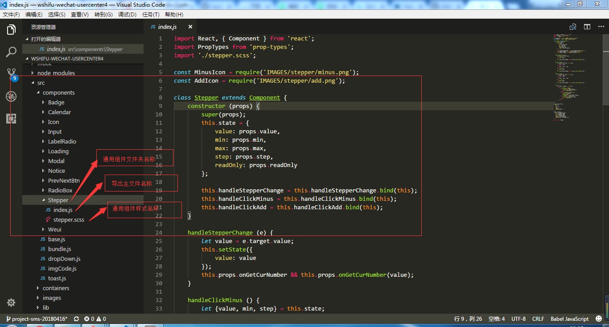

@(开发规范)

# React 开发规范

### 绑定this

**react官方推荐绑定`this`写法**
```js
class Demo extends Component {
	constructor (props) {
        super(props);
        this.state = {
            showDatePicker: false
        };

		// 绑定this
		this.handleInputNameChange = this.handleInputNameChange.bind(this);
    }

	handleInputNameChange () {
		// code 
	}

	render () {
		return (
			<div>
				<input placeholder='用户名' onChange={this.handleInputNameChange} />
			</div>
		);
	}
}
```

**方便简洁绑定`this`的写法**

统一使用箭头函数的形式绑定`this`。比如：
```js
deleteRow = () => {
	// code
}

<span onClick={this.handleClick()} />
```
如果需要在方法中传递一些值，可以使用箭头函数的形式来实现:
```js
<button onClick={(e) => this.deleteRow(id, e)}>Delete Row</button>
<button onClick={this.deleteRow.bind(this, id)}>Delete Row</button>
```

### props验证方式和设置默认值
统一使用对象属性的方式，进行数据类型验证，`static`的方式，无法应用在函数式组件中，为了统一写法。全部采取如下方式：
```js
// 推荐使用
class Demo extends Component {
	// 为props设置默认值
	static defaultProps = {
		name: 'better',
		position: 'front-end'
	}

	// props验证
	static propTypes = {
		name: PropTypes.string,
		position: PropTypes.string
	}

	render() {
		return (
			<div>
				<span>{`名字：${this.props.name}`}</span>
				<span>{`职位：${this.props.position}`}</span>
			</div>
		);
	}
}

// 方式二
class Demo extends Component {
	render() {
		return (
			<div>
				<span>{`名字：${this.props.name}`}</span>
				<span>{`职位：${this.props.position}`}</span>
			</div>
		);
	}
}
Demo.defaultProps = {
	name: 'better',
	position: 'front-end'
}

Demo.propTypes = {
	name: PropTypes.string,
	position: PropTypes.string
}
```

### 组件事件处理函数和数据获取函数命名规则
```js
// 图片引入统一放在组件声明之前
const NextIcon = require('IMAGES/goodsInfo/next.png');

class Demo extends Component {
	constructor (props) {
        super(props);
        this.state = {
            showDatePicker: false
        };
    }

	// react生命周期钩子函数放在事件处理和获取数据函数前面
	componentWillMount () {
        // code
    }

	// 加在组件时调用后台数据统一放在该生命周期
	componentDidMount () {
        // code
    }

	// 清楚定时器
	componentWillUnmount () {
		this.timer && clearTimeout(this.timer);
	}


	// 事件处理统一使用handle开头
	handleInputNameChange = (e) => {
		// code 
	}

	// 获取数据，统一使用_get开头
	_getOrderDetailData = () => {
		// code
	}

	// post提交表单，统一使用_post开头
	_postSubmit = () => {
		// code
	}

	// 渲染函数统一放在最后
	render () {
		const {showDatePicker} = this.state;
		return (
			<div>
				
				{/* html标签或组件超过三个属性时，按照以下写法 */}
				<input
					placeholder='请选择日期'
					readOnly
					value={hopeFinishTime}
					onClick={this.handleClickDatePicker} />
				{/* 三元运算太长的话，按照这种写法*/}
				{showDatePicker
					? <DataPicker />
					: null
				}
			</div>
		);
	}
}
```

### 纯组件
什么是纯组件，简单来说就是一个只用于展示的数据，完全不需要去改变`props`和`state`的组件，比如：
```js
class Hello extends Component {
	static defaultProps = {
		text: 'better'
	}

	static propTypes = {
		text: PropTypes.string
	}

	render () {
		return (
			<div>{this.props.text}</div>
		)
	}
}

import Hello from './Hello';
class ShowText extends Component {
	render () {
		return (
			<Hello text={`hello world!`} />
		)
	}
}
```
这个类的用法很简单，如果你有些组件是`纯组件`，那么把继承类从 `Component` 换成 `PureComponent` 即可。当组件更新时，如果组件的 `props` 和 `state` 都没发生改变，`render` 方法就不会触发，省去 `Virtual DOM` 的生成和比对过程，达到提升性能的目的。这种方式只适用于一些`简单的数据类型`。如果涉及到复杂数据类型`（引用类型数据）`,需要使用`immutable.js`插件,原理就是让原来的`props`发生变化。

### 通用组件文件结构以及命名规则

- 文件夹统一采用小驼峰，checkBox。
- 必须要有一个导出的index.js文件和样式

